# ios Animation Demo
This is projects including all my iOS animation demos.

---
## \#7 XHRadarView
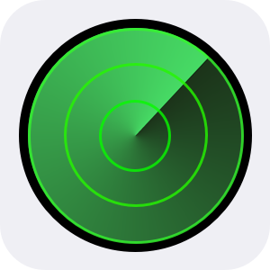</img>  
This is an animation demo to simulate the radar effect. When you launch the app, it will update your local address and start the radar effect animation. The fradient radar effect is based on the **[XHAngleGradientLayer](https://github.com/xhuang68/XHAngleGradientLayer)** (Swift) or **[AngleGradientLayer](https://github.com/paiv/AngleGradientLayer)** (Objective-C).  

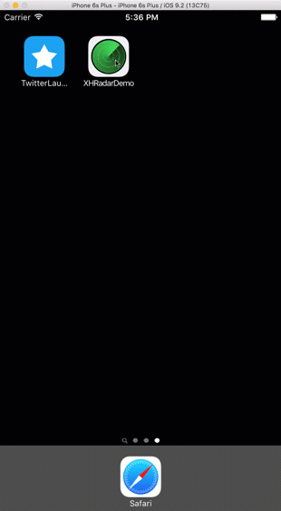  

###Find my iPhone icon
Also I drew the Apple's find my iPhone icon using Sketch. You can download the sketch file if you need.  

<a href='./07XHRadarDemo/demo/FindMyiphoneIcon'>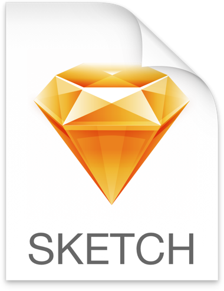</img></a>  

---
## \#6 XHGradientLabelView 
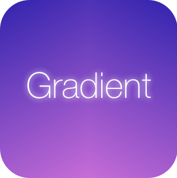</img>  
This is a custom **UIView** which supports the text gradient effect like this:  

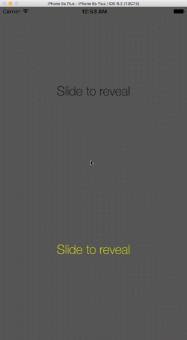  

###Usage
####Init

```swift
let gradientLabelView = XHGradientLabelView.init(frame: CGRect, withText text: String, andFont font: UIFont, withColors colors: [CGColor])
```
####Colors
You can choose any color you like to fill the text. Here are two color demos:  

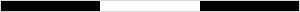

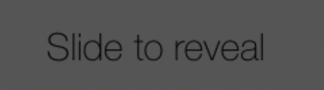  

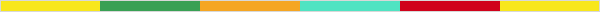

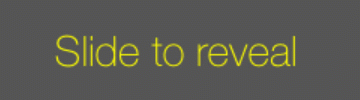  

####Installation
Copy **XHGradientLabelView.swift** to your project.

---
## \#5 XHCircleStrokeView
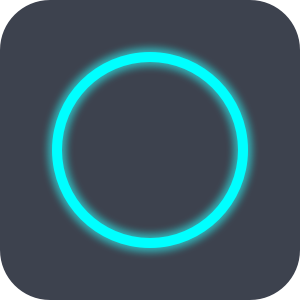</img>  
This is a custon **UIview** which supports the circle stroke animation with a time label. 

###Demo
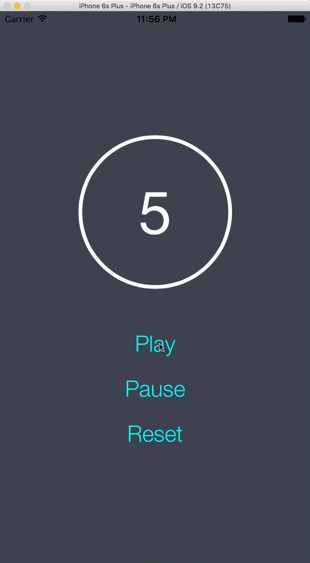

###Usage
####Init

```swift
let circleStrokeView = init(
	frame: CGRect, 
	withDuration duration: Double, 
	backColor: UIColor, 
	frontColor: UIColor, 
	fillColor: UIColor, 
	strokeWidth: CGFloat, 
	enableTimeLabel labelEnable: Bool, 
	enableGlow glowEnable: Bool)
view.addSubview(circleStrokeView)
```
Set up the view with above custom parameters. You also can enable or disable the time label and glow effect.  

####Font
You can update the time label font using  
```swift
circleStrokeView.timeLabel.font = UIFont(name: "HelveticaNeue", size: 80.0)
circleStrokeView.timeLabel.textColor = UIColor.whiteColor()
```

####Start countdown
```swift
circleStrokeView.play()
```

####Pause countdown
```swift
circleStrokeView.pause()
```

####Reset countdown
```swift
circleStrokeView.reset()
```

###Installation
Copy **XHCircleStroleView.swift** to your project.  

---
## \#4 Twitter Launch Screen Animation
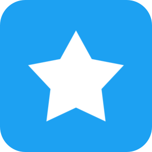</img>  
This is a Demo to reproduce twitter's launch animation

###Demo
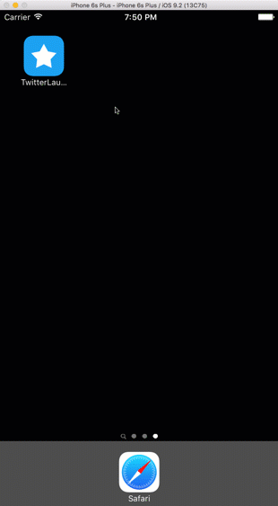

###Usage
Copy and modify the code in **AppDelegate.swift**.  
The animation is coded in side this method before the root controller is loaded:  
```swift
func application(application: UIApplication, didFinishLaunchingWithOptions launchOptions: [NSObject: AnyObject]?) -> Bool {
	// animation code
	}
```
---
## \#3 XHAnimatedCircleDemo
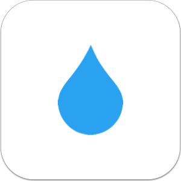</img>    
This is a demo to show the drag effect on the bubble view.  

*	The number below the view represents the draging progress.   
*	This circle layer consists of four seprate curves. And the yellow points in the view are the points to control these four curves.   
*	One of the use case of this effect could be the page control UI component. The bubble will be dragged and the shape will be changed between each page mark.

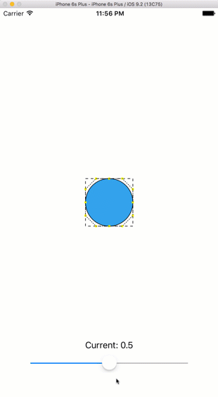

--- 
## \#2 Albums	
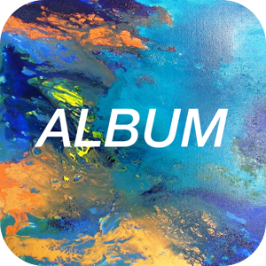</img>  
This is a demo with some cool animations using **Gestures** and **UIKit Dynamics** (*UIDynamicAnimator*, *UIAttachmentBehavior*, *UIGravityBehavior* and *UISnapBehavior*).		

   

---
## \#1 XHSlideMenuDemo	
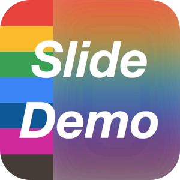</img>  
This is a custormize slide-out navigation panel.  			
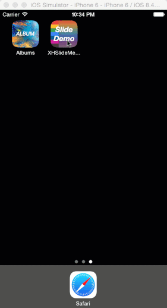   