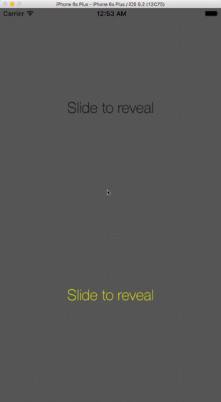
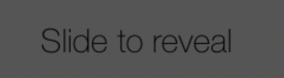
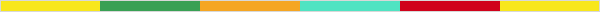
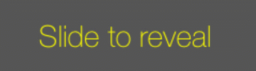
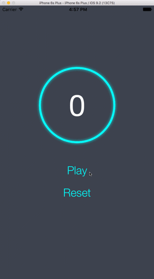
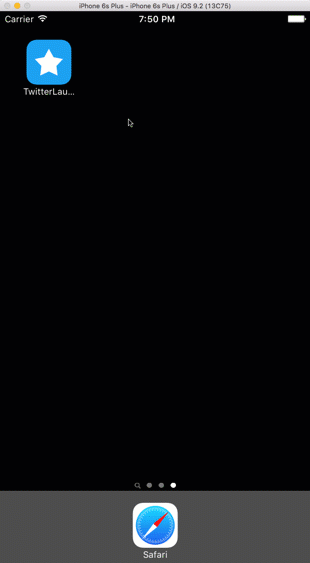
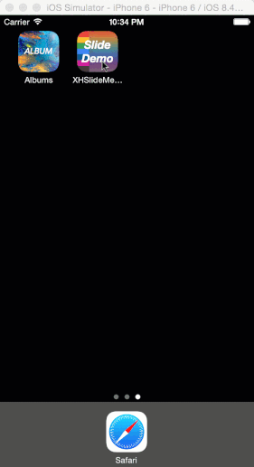

## ios Animation Demo
This is projects including all my iOS animation demos.

---
### \#5 XHGradientLabelView 
This is a custom **UIView** which supports the text gradient effect like this:

  

####Usage
#####Init

```swift
let gradientLabelView = XHGradientLabelView.init(frame: CGRect, withText text: String, andFont font: UIFont, withColors colors: [CGColor])
```
#####Colors
You can choose any color you like to fill the text. Here are two color demos:  


  



  

#####Installation
Copy **XHGradientLabelView.swift** to your project.

---
### \#4 XHCircleStrokeView
This is a custon **UIview** which supports the circle stroke animation with a time label. 

####Demo


####Usage
#####Init

```swift
let circleStrokeView = init(
	frame: CGRect, 
	withDuration duration: Double, 
	backColor: UIColor, 
	frontColor: UIColor, 
	fillColor: UIColor, 
	strokeWidth: CGFloat, 
	enableTimeLabel labelEnable: Bool, 
	enableGlow glowEnable: Bool)
view.addSubview(circleStrokeView)
```
Set up the view with above custom parameters. You also can enable or disable the time label and glow effect.  

#####Font
You can update the time label font using  
```swift
circleStrokeView.timeLabel.font = UIFont(name: "HelveticaNeue", size: 80.0)
circleStrokeView.timeLabel.textColor = UIColor.whiteColor()
```

#####Start countdown
```swift
circleStrokeView.play()
```

#####Pause countdown
```swift
circleStrokeView.pause()
```

#####Reset countdown
```swift
circleStrokeView.reset()
```

####Installation
Copy **XHCircleStroleView.swift** to your project.  

---
### \#3 Twitter Launch Screen Animation
This is a Demo to reproduce twitter's launch animation

####Demo


####Usage
Copy and modify the code in **AppDelegate.swift**.  
The animation is coded in side this method before the root controller is loaded:  
```swift
func application(application: UIApplication, didFinishLaunchingWithOptions launchOptions: [NSObject: AnyObject]?) -> Bool {
	// animation code
	}
```

--- 
### \#2 Albums	
This is a demo with some cool animations using **Gestures** and **UIKit Dynamics** (*UIDynamicAnimator*, *UIAttachmentBehavior*, *UIGravityBehavior* and *UISnapBehavior*).		

   

---
### \#1 XHSlideMenuDemo	
This is a custormize slide-out navigation panel.  			
   